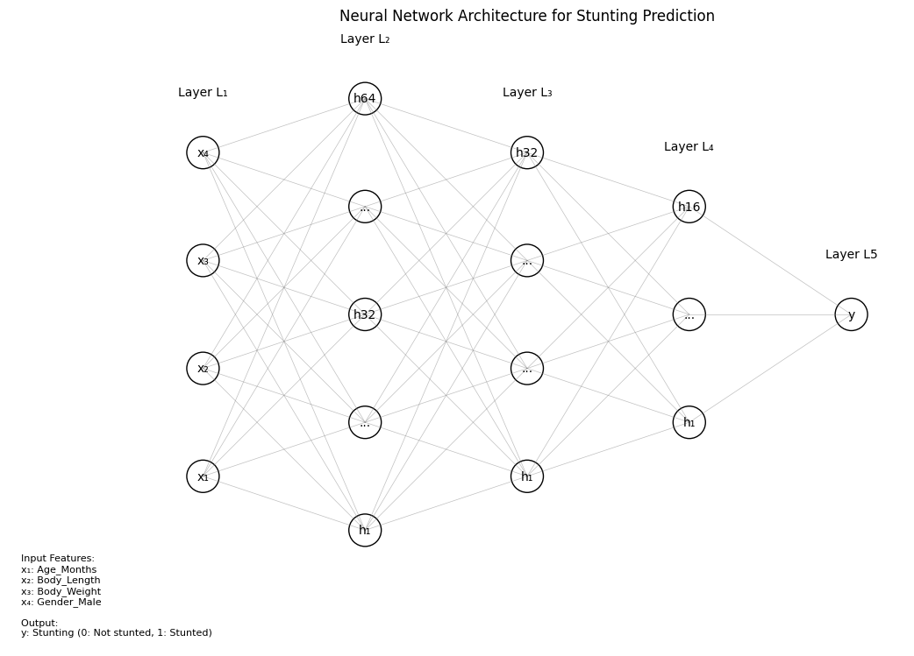
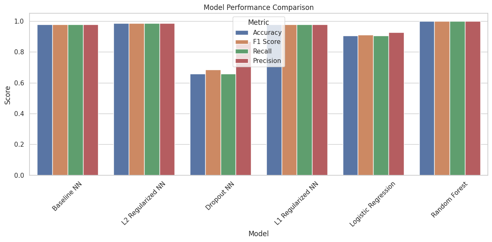

# Early Detection of Child Malnutrition using Machine Learning

## Problem Statement
Child malnutrition remains a critical public health concern, particularly in developing regions. Early detection is crucial for preventing long-term health complications. This project aims to develop a machine learning-based system that can accurately predict child stunting using anthropometric measurements and demographic data, enabling healthcare workers to identify at-risk children early and intervene appropriately.

## Dataset

The analysis uses the Stunting Wasting Dataset from Kaggle, which contains the following features:
- Gender
- Age (in months)
- Body Weight
- Body Length
- Stunting Status (Target Variable)
- Wasting Status (Not used in this analysis)

## Project Structure

```
ML/STUNTING/
├── README.md
├── notebook.ipynb
└── saved_models/
    ├── random_forest_optimized.joblib
    ├── nn_model_instance1.h5
    ├── nn_model_instance2.h5
    ├── nn_model_instance3.h5
    └── nn_model_instance4.h5
```

## Video Demonstration
For a detailed walkthrough of the project and its implementation, check out our [video demonstration](https://drive.google.com/drive/folders/1zL1vrziJ5Vb9hCgAXoaibgjJFgB9rTqY?usp=sharing).

## Model Implementations

### 1. Random Forest Classifier
- Optimized using GridSearchCV
- Hyperparameters tuned:
  - n_estimators: [100, 200, 300]
  - max_depth: [10, 20, 30, None]
  - min_samples_split: [2, 5, 10]
  - min_samples_leaf: [1, 2, 4]

### 2. Neural Network Models

#### Instance 1: Baseline Model
- Architecture: 3 hidden layers [64, 32, 16]
- Optimizer: Adam (default learning rate)
- No regularization
- Fixed 50 epochs

#### Instance 2: L2 Regularized Model
- Architecture: 3 hidden layers [64, 32, 16]
- Optimizer: Adam (learning rate = 0.0001)
- L2 regularization (strength = 0.001)
- Early stopping (patience = 10)
- Max 200 epochs

#### Instance 3: Dropout Model
- Architecture: 3 hidden layers [64, 32, 16]
- Optimizer: RMSprop (default learning rate)
- Dropout rate: 0.2
- Fixed 70 epochs

#### Instance 4: L1 Regularized Model
- Architecture: 3 hidden layers [64, 32, 16]
- Optimizer: Adam (learning rate = 0.01)
- L1 regularization (strength = 0.001)
- Fixed 100 epochs

## Model Performance Comparison

| Model | Configuration | Accuracy | F1 Score | Recall | Precision |
|-------|--------------|----------|-----------|---------|------------|
| Baseline NN | Simple 2-layer, Adam (default) | 0.9781 | 0.9778 | 0.9781 | 0.9785 |
| L2 Regularized NN | Adam (LR=0.0001), L2, Early Stopping | 0.9849 | 0.9848 | 0.9849 | 0.9850 |
| Dropout NN | RMSprop, Dropout=0.2 | 0.6582 | 0.6853 | 0.6582 | 0.8666 |
| L1 Regularized NN | Adam (LR=0.01), L1 | 0.9777 | 0.9775 | 0.9777 | 0.9776 |
| Logistic Regression | Best params: {'C': 100, 'class_weight': 'balanced'} | 0.9054 | 0.9099 | 0.9054 | 0.9260 |
| Random Forest | GridSearchCV Optimized | 0.9998 | 0.9998 | 0.9998 | 0.9998 |

## Visualizations

### Model Architecture

*Neural network architecture showing the different layers and their configurations*

### Model Comparison

*Performance comparison across different model architectures*

### Random Forest Analysis

*Random Forest feature importance and confusion matrix*

## Key Findings

1. Best Performing Model: Random Forest
   - Configuration: GridSearchCV Optimized
   - F1 Score: 0.9998
   - Accuracy: 0.9998
   - Perfect precision and recall scores

2. Impact of Regularization:
   - L2 regularization with early stopping showed improved generalization (98.49% accuracy)
   - Dropout model showed lower performance (65.82% accuracy) but good precision (86.66%)
   - L1 regularization achieved similar performance to baseline (97.77% vs 97.81%)

3. Optimization Insights:
   - Lower learning rates (0.0001) with Adam performed better than higher rates
   - RMSprop with dropout showed competitive performance despite lower accuracy
   - Early stopping helped prevent overfitting in Instance 2
   - Logistic Regression performed well (90.54% accuracy) but not as good as neural networks

## Usage

1. Install required packages:
```bash
pip install numpy pandas scikit-learn tensorflow seaborn matplotlib
```

2. Run the notebook:
```bash
jupyter notebook notebook.ipynb
```

3. For predictions using the best model:
```python
from tensorflow.keras.models import load_model
import joblib

# Load the best model (check the model type first)
if best_model_type == 'Random Forest':
    model = joblib.load('saved_models/random_forest_optimized.joblib')
else:
    model = load_model(f'saved_models/nn_model_instance{best_instance}.h5')

# Make predictions
predictions = model.predict(X_new)
```

## Future Improvements

1. Feature Engineering:
   - Create BMI (Body Mass Index) feature
   - Add age groups/categories
   - Incorporate additional health indicators if available

2. Model Enhancements:
   - Try ensemble methods combining neural networks and random forests
   - Experiment with different neural network architectures
   - Implement cross-validation for neural networks

3. Deployment:
   - Create a simple web interface for predictions
   - Develop an API endpoint for model serving
   - Add model versioning and monitoring
